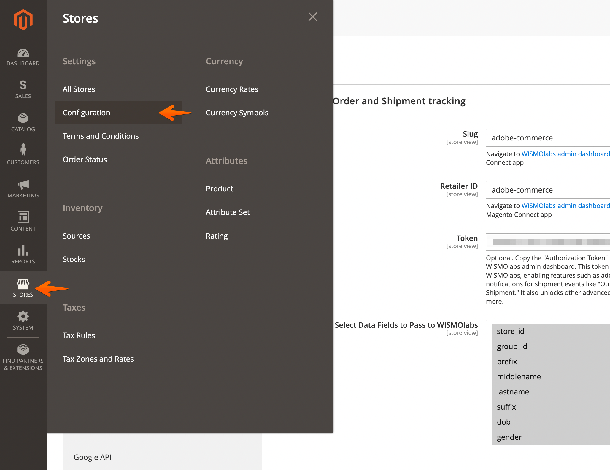
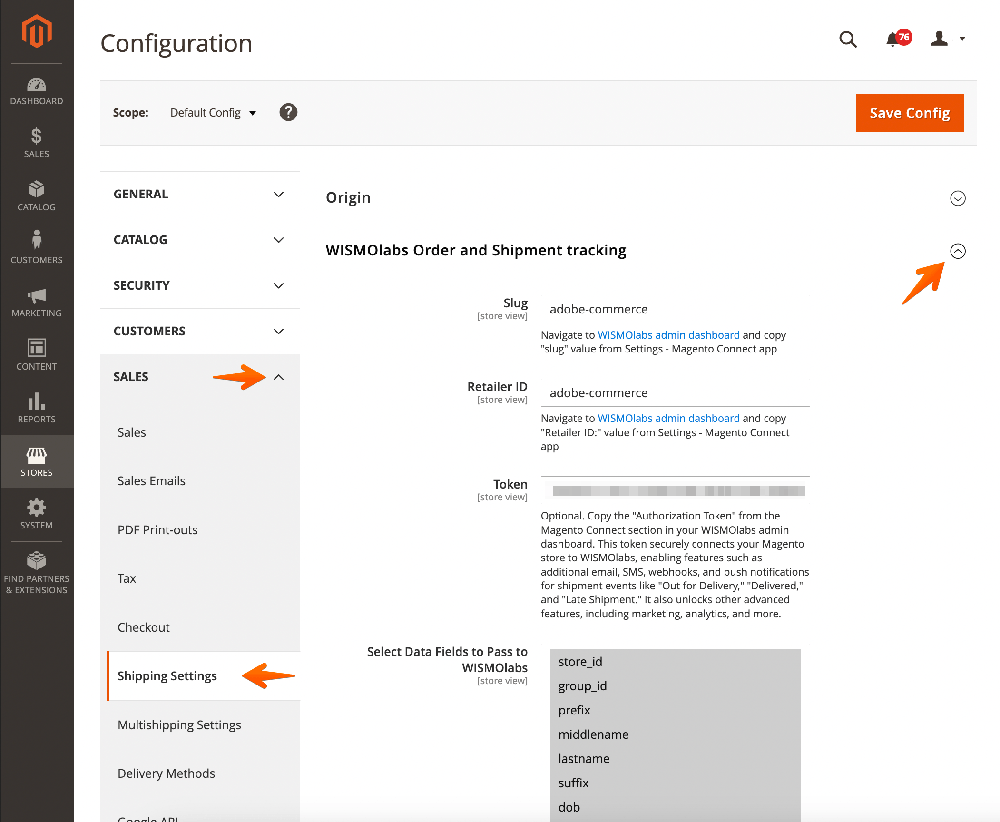
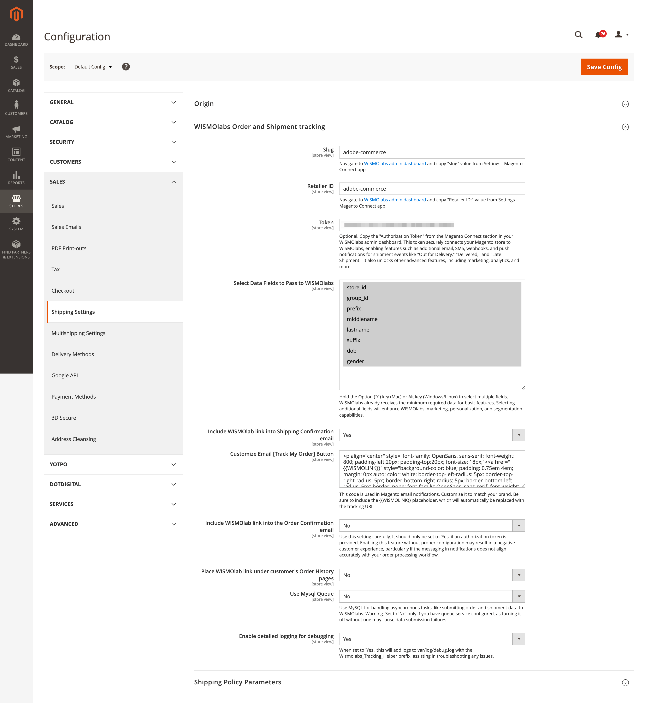

# WISMOlabs Extension for Magento 2

[Order & Shipping Tracking Suite extension for Magento](https://wismolabs.com/magento/?utm_source=github&utm_medium=magento&utm_campaign=extension) connects your store to the WISMOlabs platform, providing enhanced real-time tracking capabilities across 750+ carriers, 3PLs, and delivery companies. It also offers advanced notification capabilities, including programmable emails, SMS, and webhooks using the Liquid template engine. Platform has a built-in marketing engine that suggests, upsells, and cross-sells products within notifications, branded tracking pages, and other customer-facing components, creating better post-purchase experiences.

## Important Information

Order & Shipping Tracking Suite extension for Magento 2 does not require a WISMOlabs account to try. However, it is advisable to [create an account]([https://wismolabs.com/magento/](https://wismolabs.com/magento/?utm_source=github&utm_medium=magento&utm_campaign=extension)) to configure the branding of customer-facing components.

## Prerequisites

Magento 2: This extension requires a working installation of Magento 2.

## Installation Instructions

To install the Order & Shipping Tracking Suite extension, follow these steps:

1. Log into Your Magento Server

    - Log into your Magento 2 server and navigate to the root directory of your Magento installation.

2. Install the Extension via Composer

    Execute the following commands to install the WISMOlabs extension:

    ```
    composer require wismolabs/tracking
    bin/magento module:enable Wismolabs_Tracking
    bin/magento setup:upgrade
    ```

## Configuration Instructions

After installing the Order & Shipping Tracking Suite extension for Magento, you need to configure it in the Magento admin panel:

1.  **Step 1: Navigate to WISMOlabs Settings**

    -   From your Magento Admin dashboard, go to Stores > Configuration.

        

    -   In the left sidebar, locate Shipping Settings under Sales.

        

    -   Expand WISMOlabs Order and Shipment Tracking to access settings and configurations.

2.  **Step 2: Configure the Fields**

    

    If you are just trying out the extension and don't have the configuration you may leave theses field in their default state.

    -   **Slug**: Copy the "Slug" from the WISMOlabs admin dashboard under Settings > Magento Connect app and paste it into the "Slug" field.

    -   **Retailer ID**: Copy the "Retailer ID" from the WISMOlabs admin dashboard under Settings > Magento Connect app and paste it into the "Retailer ID" field.

    -   **Token (Optional)**: Copy the "Authorization Token" from the Magento Connect section in your WISMOlabs admin dashboard and paste it into the "Token" field. This token is required for features like email/SMS/webhooks notifications and advanced analytics.

    -   **Select Data Fields to Pass to WISMOlabs**: Use Ctrl (Cmd on Mac) + click to select multiple fields. Include fields such as store_id, group_id, prefix, lastname, dob, etc., based on your requirements.

3.  **Step 3: Optional Settings**

    -   **Include WISMOlabs Link into Shipping Confirmation Email**: Set to "Yes" if you want the tracking link to appear in shipping confirmation emails.

    -   **Customize Email [Track My Order Button]**: Modify the HTML/CSS code for the tracking button if needed. Use the placeholder {{WISMOLINK}} to insert the tracking link dynamically.

    -   **Include WISMOlabs Link into the Order Confirmation Email**: Set to "Yes" only if the Authorization Token is enabled and you have a working WISMOlabs account.

    -   **Place WISMOlabs Link under Customer's Order History Pages**: Set to "Yes" to add the tracking link to the customer's order history section.

    -   **Use MySQL Queue**: Enable if you want to handle asynchronous tasks via MySQL.

    -   **Enable Detailed Logging for Debugging**: Set to "Yes" to log details in var/log/debug.log with the Wismolabs_Tracking_Helper prefix for troubleshooting.

4.  **Step 4: Save Configuration**

    -   Click the Save Config button in the top-right corner.

    -   Flush the cache by navigating to System > Cache Management and clicking Flush Magento Cache.

## Additional Information

Support: For any issues or support requests, please contact our support team at [wismolabs.com](https://wismolabs.com/)

Documentation: For more details on configuration options and using the WISMOlabs platform, visit our help center.

### Uninstall Instructions

If you need to uninstall the extension, you can do so using the following commands:

```
bin/magento module:disable Wismolabs_Tracking
composer remove wismolabs/tracking
bin/magento setup:upgrade
```

By using WISMOlabs, you can provide your customers with up-to-date shipment information and personalized post-purchase communications to boost customer satisfaction and loyalty.
